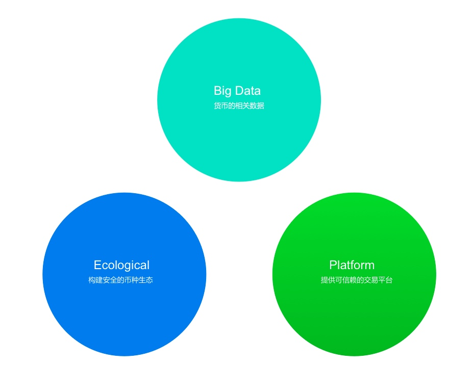
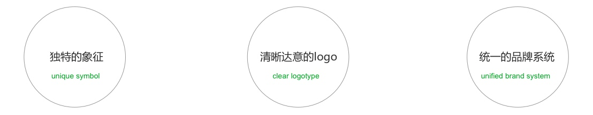
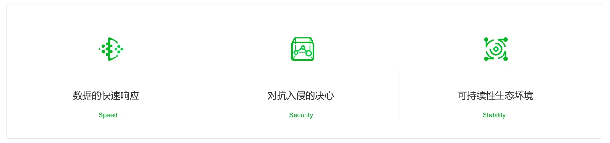
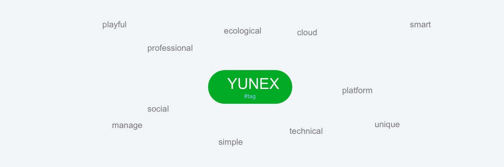
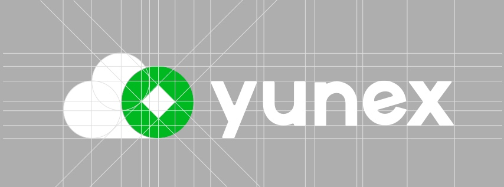
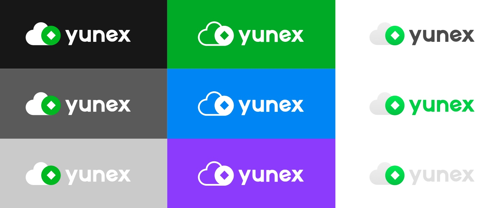
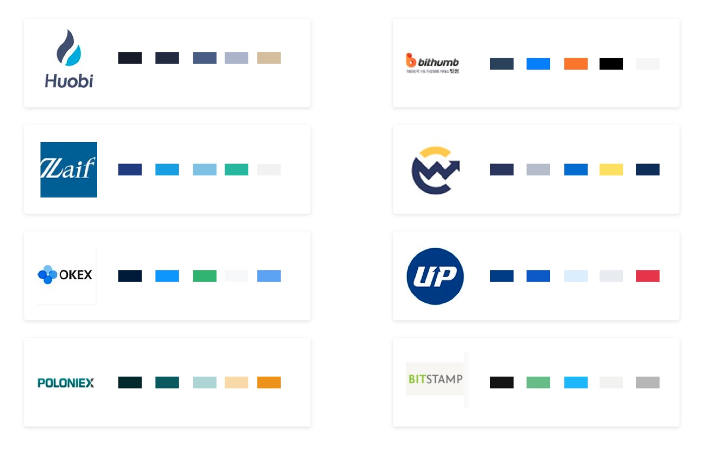
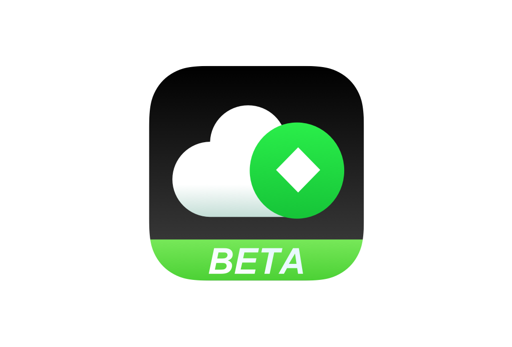

# 徽标

yunex是顺应比特币技术发展趋势而启动的项目，从基础架构开始做起，从平台实力到生态能力的建设，借由优秀团队的支撑，打造一个为用户提供详细的比特币数据，运营于一身的大型平台。 

`数字货币相关数据`,`安全的币圈生态`,`商业级可信赖的交易平台`
 
 

 
 
 

### 品牌塑造的目的： 

1、收获可交易平台的份额，给非目标用户留下可记忆的印象。 
2、为平台用户提供良好的用户体验，增加沉浸时间，提升口碑。 
 
 
 

 
 
 
### 提取新品牌的关键词：
 
 

 
 
 
### 寻找品牌建设的方向：
 
 

 
 
 
### logo构建
创意提炼：云，上升，数据，连接

 
 
 
### 造型优化

 

 
 
 

### 其他品牌基因

 
 
 

### 应用图标

